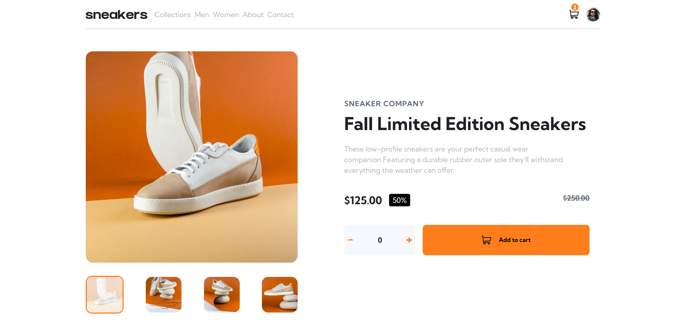

# Frontend Mentor - E-commerce product page solution

This is a solution to the [E-commerce product page challenge on Frontend Mentor](https://www.frontendmentor.io/challenges/ecommerce-product-page-UPsZ9MJp6). Frontend Mentor challenges help you improve your coding skills by building realistic projects.

## Overview

### The challenge

Users should be able to:

- View the optimal layout for the site depending on their device's screen size
- See hover states for all interactive elements on the page
- Open a lightbox gallery by clicking on the large product image
- Switch the large product image by clicking on the small thumbnail images
- Add items to the cart
- View the cart and remove items from it

### Screenshot

### Links

- Solution URL: [https://www.frontendmentor.io/solutions/e-commerce-product-page-with-vanilla-js-and-sass-iYePhfmZ_6]
- Live Site URL: [lhttps://verakissyou17.github.io/ecommerce-product-page-main/e]

## My process

### Built with

- Semantic HTML5 markup
- CSS custom properties
- Flexbox
- CSS Grid
- Mobile-first workflow
- [SCSS](https://sass-lang.com/) - For styles

### What I learned
I've learned how to make a lightbox and how the stack on the DOM can influence your design.

### Continued development
I'll continue to make more projects to improve my skills and knowdlege.

### Useful resources

- [MDN](https://developer.mozilla.org/en-US/) 

### AI Collaboration

I've used ChatGPT to hepl me with the lightbox.

## Author

- Website - [Ciuca Veronica](https://github.com/verakissyou17)
- Frontend Mentor - [@verakissyou17](https://www.frontendmentor.io/profile/verakissyou17)

